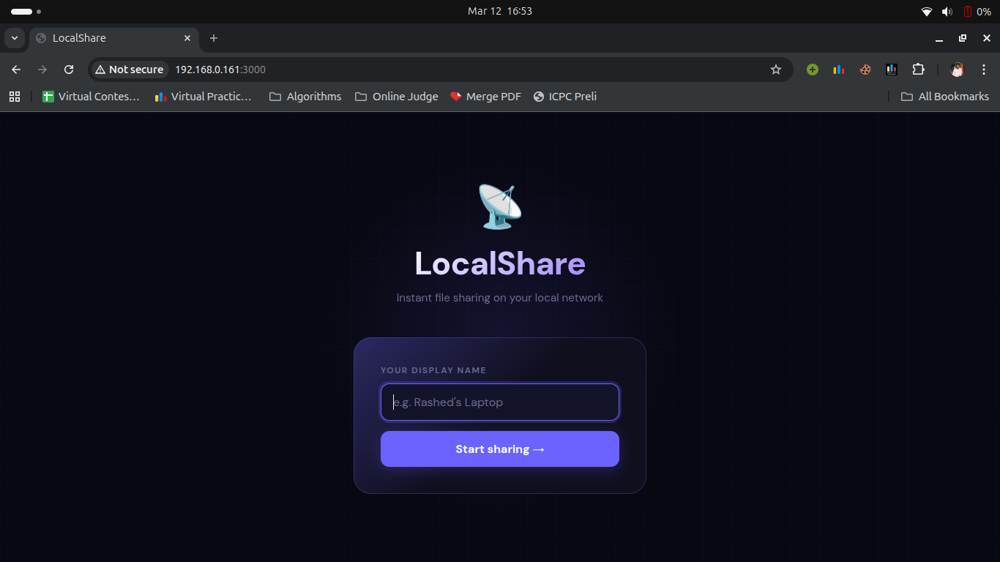
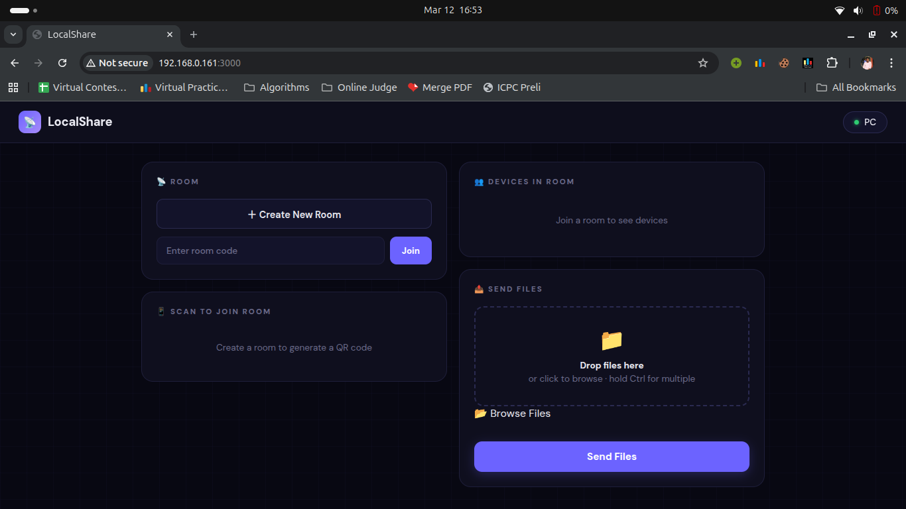
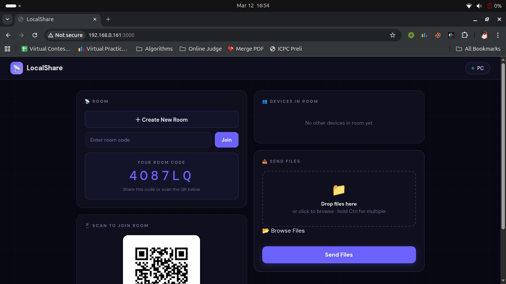
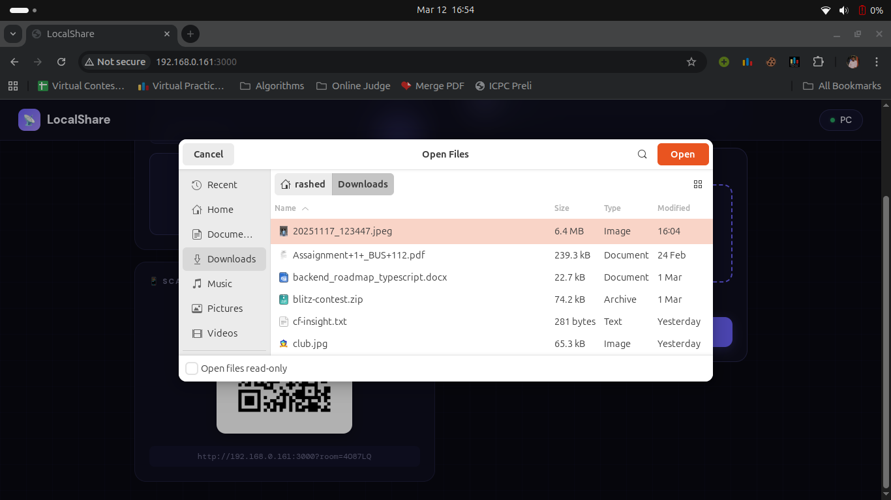
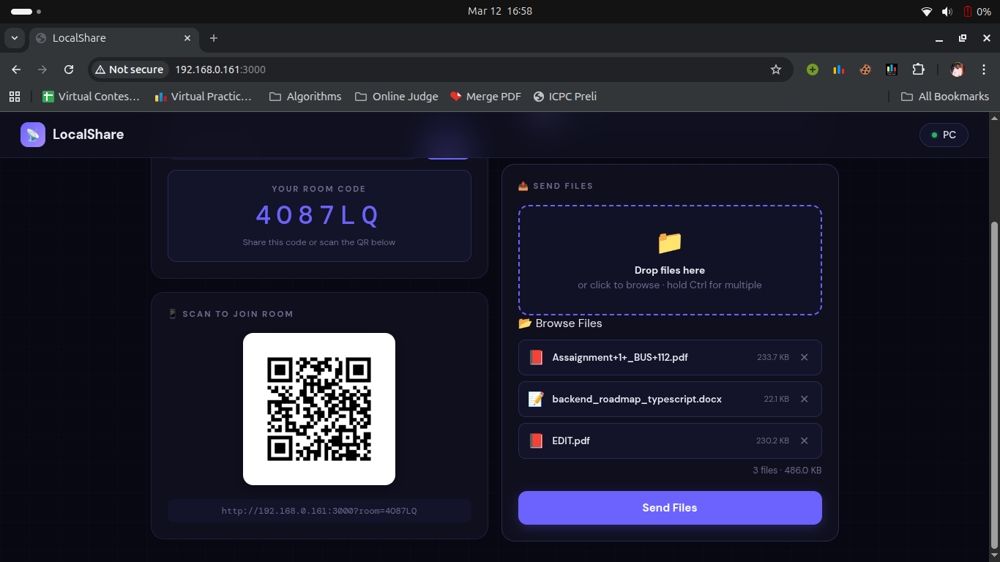
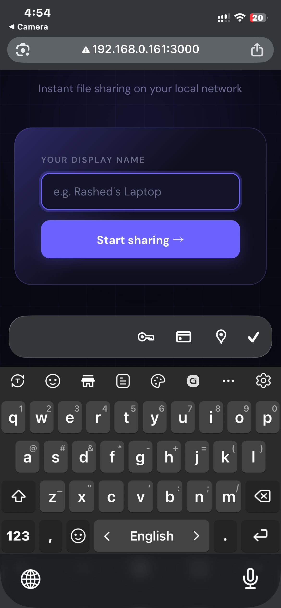
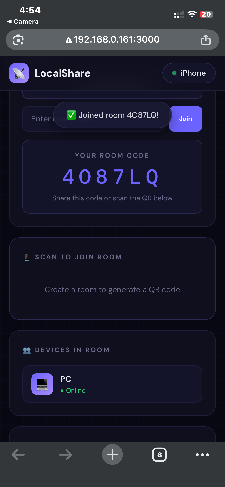
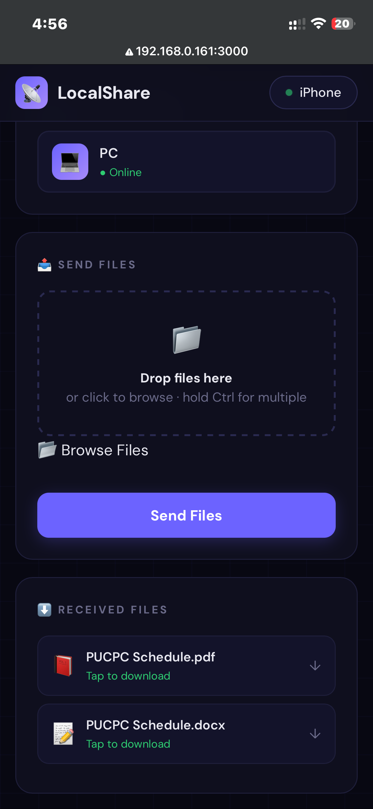
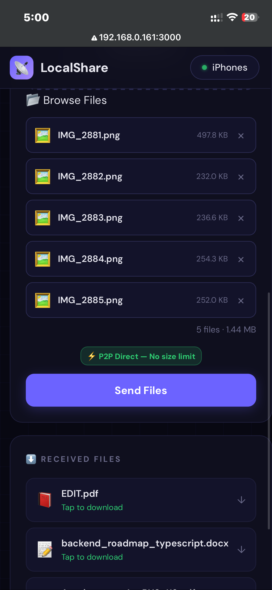
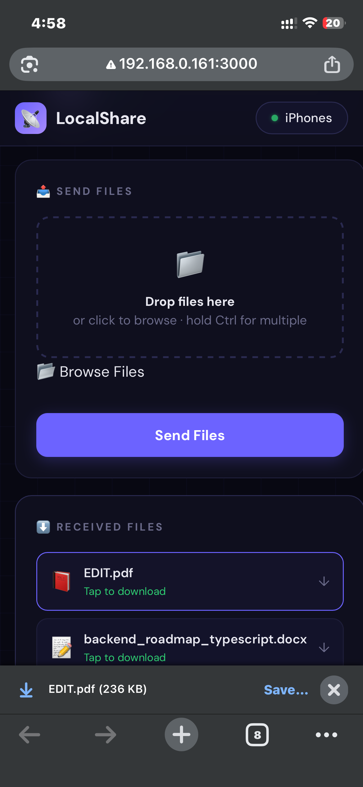

# 📡 LocalShare

> Instant file sharing over your local WiFi network — no internet required, no accounts, no limits.

LocalShare is an **AirDrop-style web app** that runs on your local network. Open it on any device with a browser, join a room, and share files at full WiFi speed. Built with Node.js, TypeScript, Socket.IO, and WebRTC.

---

## ✨ Features

- ⚡ **P2P Direct Transfer** — WebRTC peer-to-peer, no size limit, full WiFi speed
- 🔄 **Server Relay Fallback** — automatic fallback when P2P isn't available
- 📱 **Works everywhere** — PC, iPhone, Android, any modern browser
- 🏠 **Room system** — create or join rooms with a 6-character code
- 📷 **QR code join** — scan from phone to instantly join a room
- 📦 **Multi-file queue** — select and send multiple files at once
- 📊 **Live progress** — real-time speed, ETA, and transfer type display
- 🌙 **PWA support** — install as a native app on mobile
- 🔒 **100% local** — your files never leave your network

---

## 📸 Screenshots

### PC

| Setup | Dashboard | Room + QR |
|-------|-----------|-----------|
|  |  |  |

| File Picker | File Queue |
|-------------|------------|
|  |  |

### Mobile (iPhone)

| Setup | Room Joined | Files Received |
|-------|-------------|----------------|
|  |  |  |

| Multi-file Queue | Download |
|-----------------|----------|
|  |  |

---

## 🚀 Getting Started

### Prerequisites

- Node.js 18+
- npm

### Installation

```bash
# Clone the repo
git clone https://github.com/MRashedHossain/localshare.git
cd localshare

# Install dependencies
npm install

# Start the dev server
npm run dev
```

The server will start and print your local IP:

```
🚀 LocalShare is running!
📡 Server: http://localhost:3000
📡 Local:  http://192.168.x.x:3000
```

Open `http://192.168.x.x:3000` on **any device on the same WiFi** to start sharing.

### Build for production

```bash
npm run build
npm start
```

---

## 🛠️ Tech Stack

| Layer | Technology |
|-------|-----------|
| Runtime | Node.js + TypeScript |
| Server | Express.js |
| Real-time | Socket.IO |
| P2P Transfer | WebRTC Data Channels |
| ORM | — (no database, in-memory) |
| Frontend | Vanilla HTML/CSS/JS |
| PWA | Service Worker + Web Manifest |

---

## 📁 Project Structure

```
localshare/
├── src/
│   ├── server.ts           # Entry point
│   ├── app.ts              # Express app setup
│   ├── sockets/
│   │   └── index.ts        # All Socket.IO + WebRTC signaling events
│   ├── services/
│   │   ├── network.ts      # Local IP detection + QR code generation
│   │   ├── room.ts         # Room create/join/leave logic
│   │   └── transfer.ts     # Chunked file transfer sessions
│   ├── routes/
│   │   ├── health.ts       # GET /health
│   │   ├── info.ts         # GET /info, GET /info/qr
│   │   └── room.ts         # GET /room/:code
│   └── public/
│       ├── index.html      # Full frontend (single file)
│       ├── manifest.json   # PWA manifest
│       └── sw.js           # Service worker
├── .env                    # PORT=3000, APP_NAME=LocalShare
├── tsconfig.json
├── nodemon.json
└── package.json
```

---

## ⚙️ How It Works

### Transfer Flow

```
Sender selects device
    ↓
P2P handshake starts immediately (WebRTC offer/answer via Socket.IO)
    ↓
Sender picks files + clicks Send
    ↓
P2P ready? ──YES──→ sendFileP2P()   (256KB chunks, event-driven backpressure)
               ↓                     Full WiFi speed, no size limit
              NO
               ↓
           sendFileViaServer()       (64KB chunks via Socket.IO relay)
           Max ~500MB
```

### P2P Speed Optimization

The sender uses **event-driven backpressure** instead of polling:

```
Keep pipe full ──→ buffer > 8MB? ──→ pause
                                      ↓
                   buffer < 1MB? ──→ resume (bufferedamountlow event)
```

This keeps the WebRTC data channel saturated at all times — achieving full local WiFi speeds (typically 20–80 MB/s).

---

## 🌐 Environment Variables

| Variable | Default | Description |
|----------|---------|-------------|
| `PORT` | `3000` | Server port |
| `APP_NAME` | `LocalShare` | App display name |

---

## 📜 License

MIT — free to use, modify, and distribute.

---

## 🙏 Acknowledgements

Inspired by [Snapdrop](https://snapdrop.net) and Apple AirDrop.
Built as a TypeScript/Node.js learning project.
